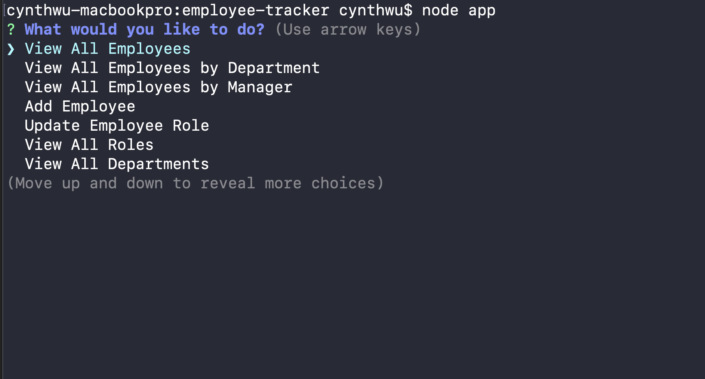
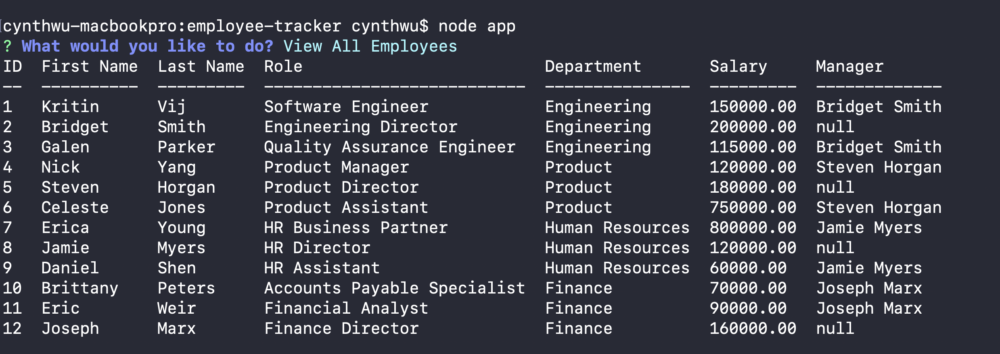

# Employer Tracker Application

Explore the [project page](https://github.com/cynthiwu/employee-tracker)


## Table of Contents
- [About The Project](#about-the-project)
    - [Built With](#built-with)
- [Installation](#installation)
- [Usage](#usage)
  - [Demo](#demo)
- [Contributing](#contributing)
- [License](#license)
- [Contact](#contact)


## About The Project

The goal of this project was to create a **C**ontent **M**anagement **S**ystem interface, specifically to manage an employee database of a given company. This CMS was created using node, inquirer, and MySQL.

<hr>



<hr>



<hr>

### Built With

This project was built using:

* JavaScript
* [Node.js](https://nodejs.org/api/fs.html)
* [Inquirer.js](https://www.npmjs.com/package/inquirer)
* [MySQL2](https://www.npmjs.com/package/mysql2)
* [MySQL Workbench](https://www.mysql.com/products/workbench/)
* [ctable](https://www.npmjs.com/package/ctable)
* [dotenv](https://www.npmjs.com/package/dotenv)

## Installation

While not necessary to run the program via the live link above, you may get a local copy up and running by following these simple steps:

1. Clone the repo
```sh
git clone git@github.com:cynthiwu/employee-tracker.git 
```

2. Install NPM packages (i.e., Inquirer)
```sh
npm install
```

To install individually, you may execute the following:
```sh
npm install --save inquirer mysql2 ctable dotenv
```

3. Install MySQL Workbench via the following [link](https://www.mysql.com/products/workbench/)

## Usage

This project can be used to add and track information on employees, roles, and departments for a given company. If the desire is to test the product, the user should set up the database schema and seed data in their MySQL Workbench before getting started. Once complete, the user can start the program by typing the below into the terminal of the project directory:

```sh
node app
```
Once running, the user can select any action he/she would like to complete:

- "View All Employees"
- "View All Employees by Department"
- "View All Employees by Manager"
- "Add Employee"
- "Update Employee Role"
- "View All Roles"
- "View All Departments"
- "Add Role"
- "Add Department"
- "Quit"


### Demo

Watch the video below to see how the program works.


## Contributing

Contributions are what make the open source community such an amazing place to  learn, inspire, and create. Any contributions you make are **greatly appreciated**.

1. Fork the Project
2. Create your Feature Branch (`git checkout -b feature/AmazingFeature`)
3. Commit your Changes (`git commit -m 'Add some AmazingFeature'`)
4. Push to the Branch (`git push origin feature/AmazingFeature`)
5. Open a Pull Request

## License

None

## Contact

Cynthia Wu - [@cynthia21wu](https://twitter.com/cynthia21wu) - cynthia21wu@gmail.com

Project Link: [https://github.com/cynthiwu/note-taker](https://github.com/cynthiwu/employee-tracker)
